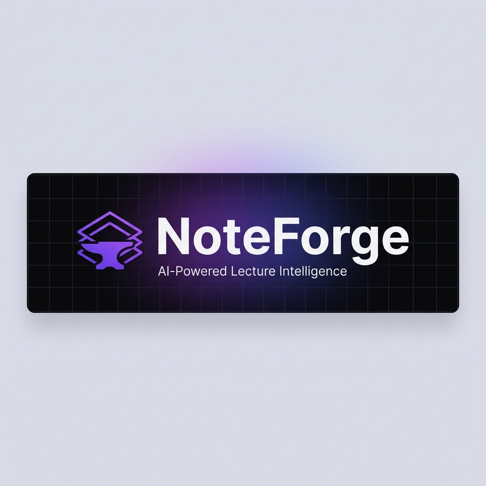
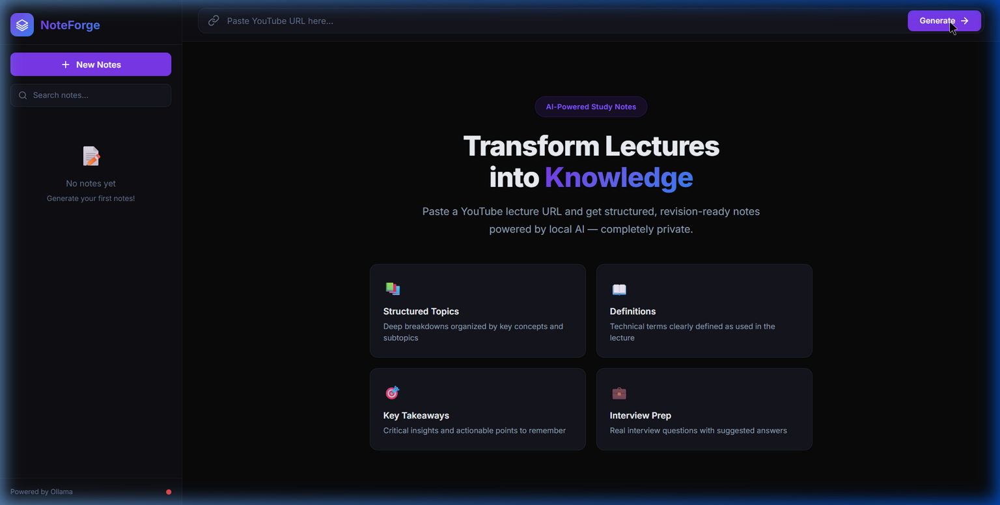

<p align="center">
  
</p>

<p align="center">
  <strong>Transform YouTube lectures into structured, revision-ready study notes — powered by local AI.</strong>
</p>

<p align="center">
  
  
  
  
  
</p>

<p align="center">
  
  
  
</p>

---

## 🔥 What is NoteForge?

NoteForge is an **AI-powered lecture intelligence system** that takes any YouTube lecture and transforms it into comprehensive, beautifully structured study notes — all running **locally on your machine** with zero cloud dependencies.

Paste a YouTube URL. Get back organized topics, definitions, formulas, examples, key takeaways, interview questions, and curated resources. All in seconds.

<p align="center">
  
</p>

---

## ✨ Features

| Feature | Description |
|---------|-------------|
| 🎥 **YouTube Integration** | Extracts transcripts from any YouTube video (supports all URL formats) |
| 🧠 **Local LLM Inference** | Uses Ollama for 100% private, offline AI processing |
| 📚 **Structured Notes** | Topics with subtopics, definitions, formulas, examples |
| 🎯 **Key Takeaways** | Critical insights distilled from the lecture |
| 💼 **Interview Prep** | Auto-generated interview questions with suggested answers |
| 🔗 **Resource Suggestions** | Related textbooks, courses, and documentation |
| 💾 **Persistent Storage** | All notes saved locally in SQLite — never lose your work |
| 📋 **Export Options** | Copy as Markdown or download `.md` files |
| 🔄 **Model Fallback** | Automatic fallback to secondary model if primary fails |
| 🌙 **Premium Dark UI** | Stunning dark-mode interface with smooth animations |
| 📱 **Responsive** | Works on desktop and mobile browsers |

---

## 🏗️ Architecture

```
NoteForge/
├── backend/                  # FastAPI backend
│   ├── app/
│   │   ├── api/routes.py         # REST API endpoints
│   │   ├── core/config.py        # Environment configuration
│   │   ├── db/database.py        # SQLite async database
│   │   ├── models/note.py        # Pydantic schemas
│   │   ├── prompts/              # LLM prompt templates
│   │   ├── services/
│   │   │   ├── youtube.py        # Transcript extraction
│   │   │   ├── summarizer.py     # Ollama LLM inference
│   │   │   ├── formatter.py      # Response normalization
│   │   │   └── notes_store.py    # CRUD persistence
│   │   └── main.py               # App entry point
│   ├── requirements.txt
│   └── .env
├── frontend/                 # Vanilla JS frontend
│   ├── index.html
│   ├── css/styles.css
│   └── js/
│       ├── api.js                # API client
│       └── app.js                # Application logic
└── assets/                   # Project assets
```

---

## 🚀 Quick Start

### Prerequisites

- **Python 3.11+**
- **Ollama** — [Install here](https://ollama.com/download)
- A pulled model (e.g., `qwen2.5` or `mistral`)

### 1. Clone the repo

```bash
git clone https://github.com/yourusername/NoteForge.git
cd NoteForge
```

### 2. Set up the backend

```bash
cd backend
python -m venv venv

# Windows
.\venv\Scripts\activate

# macOS/Linux
source venv/bin/activate

pip install -r requirements.txt
```

### 3. Configure environment

```bash
cp .env.example .env
# Edit .env if needed (defaults work out of the box)
```

### 4. Pull an Ollama model

```bash
ollama pull qwen2.5
ollama serve
```

### 5. Start NoteForge

```bash
cd backend
python -m uvicorn app.main:app --reload --port 8000
```

Open **http://localhost:8000** and start generating notes! 🎉

---

## 🔌 API Reference

All endpoints are prefixed with `/api/v1`.

| Method | Endpoint | Description |
|--------|----------|-------------|
| `GET` | `/health` | Health check + Ollama status |
| `POST` | `/generate-notes` | Generate notes from YouTube URL |
| `GET` | `/notes` | List all saved notes |
| `GET` | `/notes/{id}` | Get full note by ID |
| `DELETE` | `/notes/{id}` | Delete a note |

### Generate Notes

```bash
curl -X POST http://localhost:8000/api/v1/generate-notes \
  -H "Content-Type: application/json" \
  -d '{"youtube_url": "https://www.youtube.com/watch?v=VIDEO_ID"}'
```

Full interactive docs available at **http://localhost:8000/docs** (Swagger UI).

---

## ⚙️ Configuration

All settings are managed via environment variables (`.env` file):

| Variable | Default | Description |
|----------|---------|-------------|
| `OLLAMA_BASE_URL` | `http://localhost:11434` | Ollama server address |
| `OLLAMA_PRIMARY_MODEL` | `qwen2.5` | Primary model for inference |
| `OLLAMA_FALLBACK_MODEL` | `mistral` | Fallback if primary fails |
| `OLLAMA_TIMEOUT` | `120` | Request timeout (seconds) |
| `OLLAMA_MAX_TOKENS` | `4096` | Max tokens for generation |
| `OLLAMA_TEMPERATURE` | `0.3` | LLM temperature (lower = focused) |
| `DEBUG` | `true` | Enable debug logging |

---

## 📝 Notes Output Structure

Every generated note includes:

```json
{
  "title": "Lecture title inferred from content",
  "summary": "3-5 sentence executive summary",
  "topics": [{ "title": "...", "content": "...", "subtopics": [] }],
  "definitions": [{ "term": "...", "definition": "..." }],
  "formulas": ["y = mx + b (Linear equation)"],
  "examples": ["Real-world example from the lecture"],
  "key_takeaways": ["Critical insight to remember"],
  "interview_questions": [{ "question": "...", "suggested_answer": "..." }],
  "resources": [{ "title": "...", "link": "..." }]
}
```

---

## 🛡️ Privacy First

NoteForge is designed with privacy as a core principle:

- 🔒 **All processing happens locally** — your data never leaves your machine
- 🚫 **No API keys required** — no OpenAI, no cloud services
- 💾 **Local database** — notes stored in a local SQLite file
- 🌐 **Only outbound call** — YouTube transcript fetch (no auth required)

---

## 🗺️ Roadmap

- [ ] PDF export with styled formatting
- [ ] Batch processing (multiple URLs at once)
- [ ] Direct video upload support (local files)
- [ ] Quiz mode — test yourself on generated content
- [ ] Flashcard generation (Anki-compatible)
- [ ] Multi-language transcript support
- [ ] Chrome extension for one-click note generation

---

## 🤝 Contributing

Contributions are welcome! Feel free to open issues and pull requests.

1. Fork the repository
2. Create your feature branch (`git checkout -b feature/amazing-feature`)
3. Commit your changes (`git commit -m 'Add amazing feature'`)
4. Push to the branch (`git push origin feature/amazing-feature`)
5. Open a Pull Request

---

## 📄 License

This project is licensed under the MIT License — see the [LICENSE](LICENSE) file for details.

---

<p align="center">
  <sub>Built with ❤️ using FastAPI, Ollama, and vanilla JavaScript</sub>
</p>
